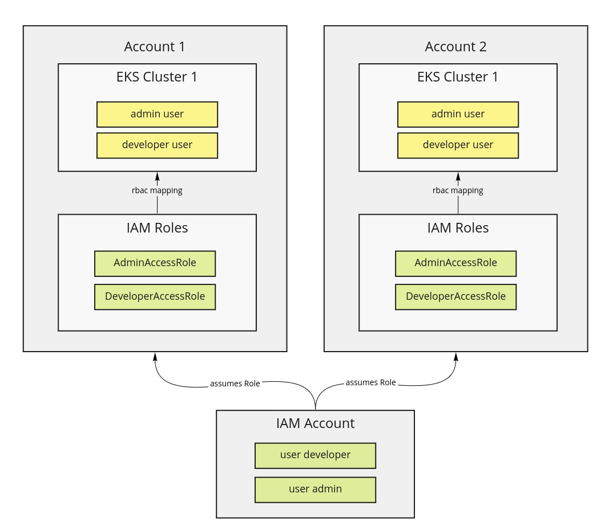

# aws-mfa-login
Small CLI tool to do aws with mfa and update credentials in local aws config.
It will create or update a destination profile with temporary credentials for `aws_access_key_id`, `aws_secret_access_key` and `aws_session_token`.
Those credentials will be valid for 12 hours by default.

## Getting started

### Install using go

For this, go must be installed on your system. 

Install executable with golang
```bash
go get github.com/signavio/aws-mfa-login
```
Make sure your go path is part of your PATH environment variable: 
```
export GOPATH="~/go"
export PATH="${PATH}:${GOPATH}/bin/"
```
If you get an error message:
```
cannot find package "github.com/hashicorp/hcl/hcl/printer" in any of:
```
run
```
export GO111MODULE=on
```
before installing `aws-mfa-login`

### Install from binary (Recommended)

```console
curl -L "https://github.com/signavio/aws-mfa-login/releases/latest/download/aws-mfa-login_$(uname)_amd64.gz" -o aws-mfa-login.gz
gunzip aws-mfa-login.gz && chmod +x aws-mfa-login && sudo mv aws-mfa-login /usr/local/bin/aws-mfa-login
```

### Post-install

Check your installation - this should work now: 

```console
$ aws-mfa-login -h
CLI tool to update your temporary AWS credentials

Usage:
  aws-mfa-login [flags]
  aws-mfa-login [command]

Available Commands:
  aws         setup or view your aws config
  cluster     view or setup your kubeconfig
  completion  Generates bash completion scripts
  help        Help about any command

Flags:
      --config string        config file (default is $HOME/.aws-mfa.yaml)
  -d, --destination string   destination profile for temporary aws credentials
  -h, --help                 help for aws-mfa-login
      --no-color             disable colorized output
  -s, --source string        source profile where mfa is activated
      --version              version for aws-mfa-login
```
Create your application configuration and save it to `~/.aws-mfa.yaml` :
```yaml
source: some-source-profile
destination: some-destination-profile
```
`Source` is source profile where MFA is already activated and the key and secret id is configured.
The tool will create a new profile entry if `destination` profile does not exist yet or update accordingly.
Run the tool to update the session token in your local aws credentials.

For example, for `~/.aws-mfa.yaml` with content
```yaml
source: suite
destination: suite-mfa
```
... the output may be: 
```console
$ aws-mfa-login 
Current configuration located in ~/.aws-mfa.yaml
#####
source: suite
destination: suite-mfa

detected MFA device with serial number arn:aws:iam::123456:mfa/username
enter 6-digit MFA code: 123456

Successfully updated access tokens for profile suite-mfa.
Access will be valid for 11 hours. You can now use that profile.

export AWS_PROFILE=suite-mfa
```

## Setup kubernetes access

This function can be useful when:
* you have setup the recommended role structure of AWS you have an IAM Account that contains the AWS users
* those users assume roles in target account like where the eks cluster lives
* you map roles to RBAC users



you can provide information for static clusters in the yaml see example:
```yaml
source: suite
destination: suite-mfa
clusters:
    - name: eks-staging
      alias: suite-staging
      accountId: "1234"
      role: DeveloperAccessRole
      region: eu-central-1
    - name: eks-prod
      alias: suite-academic
      accountId: "4321"
      role: DeveloperAccessRole
      region: eu-central-1
```
This will create aws profiles for each cluster and reference the profile in the kubeconfig.
Cluster where you don't have access to or that don't exist, will be skipped.
```bash
$ aws-mfa-login aws setup
Updated aws credentials in ~/.aws/credentials
2 sections updated and 0 sections created

$ aws-mfa-login cluster setup
Successfully setup kubeconfig for cluster karl-default
Successfully setup kubeconfig for cluster staging-uk-default
Skipping setup for cluster suite-staging No cluster found for name: suite-staging.
Skipping setup for cluster eks-prod-eu because not authorized

You can now switch the context. Kubectx is recommenend, although it's also possible with plain kubectl.
kubectx suite-dev-cf
kubectl config use-context suite-dev-cf

```

## Autocompletion

Refer to Cobra [Autocompletion](https://github.com/spf13/cobra/blob/master/shell_completions.md)

```bash
aws-mfa-login completion --help

To load completions:

Bash:

  $ source <(yourprogram completion bash)

  # To load completions for each session, execute once:
  # Linux:
  $ aws-mfa-login completion bash > /etc/bash_completion.d/aws-mfa-login
  # macOS:
  $ aws-mfa-login completion bash > /usr/local/etc/bash_completion.d/aws-mfa-login

Zsh:

  # If shell completion is not already enabled in your environment,
  # you will need to enable it.  You can execute the following once:

  $ echo "autoload -U compinit; compinit" >> ~/.zshrc

  # To load completions for each session, execute once:
  $ aws-mfa-login completion zsh > ~/.oh-my-zsh/completions/_aws-mfa-login
  
  # verify that ~/.oh-my-zsh/completions is in your fpath
  $ print -l $fpath 

  # You will need to start a new shell for this setup to take effect.

fish:

  $ aws-mfa-login completion fish | source

  # To load completions for each session, execute once:
  $ aws-mfa-login completion fish > ~/.config/fish/completions/aws-mfa-login.fish

PowerShell:

  PS> aws-mfa-login completion powershell | Out-String | Invoke-Expression

  # To load completions for every new session, run:
  PS> aws-mfa-login completion powershell > aws-mfa-login.ps1
  # and source this file from your PowerShell profile.

Usage:
  aws-mfa-login completion [bash|zsh|fish|powershell]

```

# Development

## Versioning
Use [Conventional Commit Messages](https://www.conventionalcommits.org/en/v1.0.0/).
[Semantic Release](https://github.com/semantic-release/semantic-release) will release a new version with changelog.

examples:
``` 
# increase patch version
fix: fixing tests

# incease minor version
feat: add configuration

# increase major version:
BREAKING CHANGE: increase major version of rds

# update docu
docs: update readme
```


